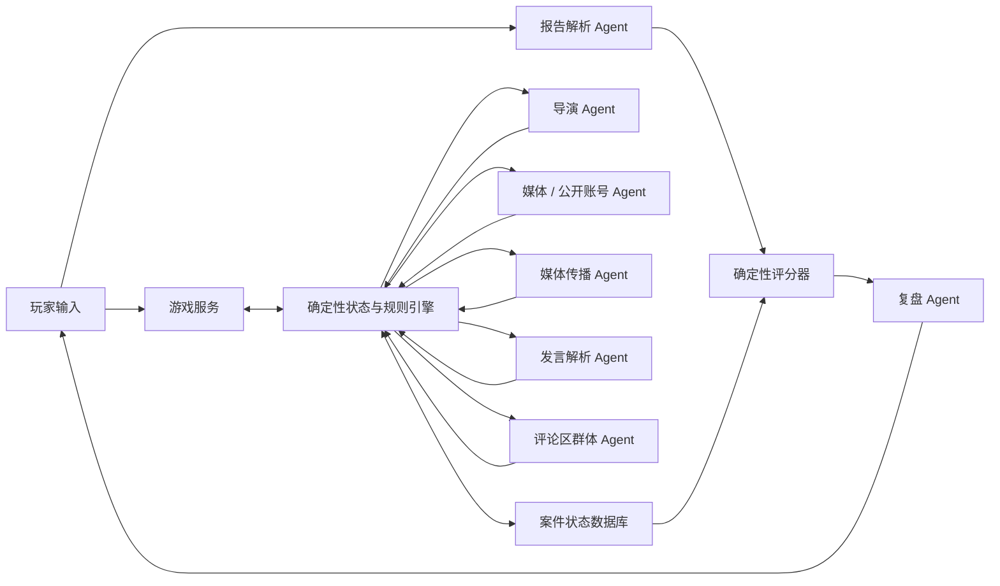

# 《它说》游戏计划书

> 项目目录：`TaShuo`  
> 游戏名称：《它说》  
> 文档版本：v0.5  
> 最后更新：2026-07-30  
> 当前阶段：概念验证与 MVP 设计  
> 类型：单人信息调查 / 多用户在线服务 / 媒体素养解谜 / Multi-Agent 叙事

---

## 一、项目概述

### 1.1 一句话定义

玩家以一名普通网友的身份置身于一场持续发酵的公共事件中，只能从电视新闻、报纸、自媒体贴文、短视频文字描述及其公开评论区收集信息，拆解主张、追溯来源、交叉验证并重建事实；当事件热度消散后，玩家提交自己的调查报告，由规则引擎与 Agent 联合评分。

### 1.2 核心命题

现代信息误导往往不是完全捏造，而是九真一假、选择性陈述、剪裁上下文、混淆事实与观点，或者在证据尚不充分时抢先给出确定结论。

《它说》不要求玩家寻找一个“唯一说谎者”，而是训练玩家回答四个问题：

1. 到底发生了什么？
2. 每个结论由哪些证据支持或反驳？
3. 信息在传播过程中发生了什么变化？
4. 哪些部分仍然无法确定？

### 1.3 标题含义

“它说”既指媒体、平台、算法和机构正在对玩家说话，也刻意省略了“它是谁”与“它为什么这样说”。玩家首先看到的是话语，随后才逐步发现话语背后的来源、利益、知识边界和传播路径。

建议宣传语：

> 每个人都说了一部分真话。

### 1.4 目标玩家

- 喜欢调查、推理、档案整理和非线性叙事的玩家。
- 对新闻传播、社会议题和信息真实性有兴趣的玩家。
- 希望学习来源核验、证据分级和不确定性表达的青少年及成年人。

### 1.5 核心体验支柱

1. **信息不完整**：任何单一来源都无法提供完整真相。
2. **传播会变形**：同一事实经过标题、转述、剪辑和评论后会产生不同含义。
3. **时间自然流逝**：未暂停时，事件和网络舆论持续发展；玩家可以暂停阅读和整理已有内容。
4. **证据高于立场**：来源的立场不能直接证明其内容为真或为假。
5. **允许保留判断**：准确地说“不知道”比没有证据的确定结论得分更高。
6. **结论必须可复盘**：玩家应当清楚自己为何得分、为何失分。

---

## 二、设计原则

### 2.1 真相先于表演

每个案件在开局前必须拥有固定、结构化、带版本号的事实图谱。Agent 只能依据事实图谱和自己的知识范围进行表达，无权修改案件真相。

### 2.2 Agent 负责角色，规则负责胜负

- Agent 负责媒体文风、账号发言、评论区互动、传播变体和自然语言反馈。
- 规则引擎负责时间流逝、暂停状态、内容发布、渠道可用性、事实状态、来源链和基础分数。
- 评分 Agent 可以解析玩家自由文本，但不得独立决定最终分数。

### 2.3 不把整篇内容粗暴标成真假

一篇报道可能同时包含真实数据、错误因果、未经证实的推测和有意省略的背景。系统以“原子主张”为最小判定单位，而不是把文章整体标记为真新闻或假新闻。

### 2.4 不把立场当作答案

游戏不评价玩家是否赞同某个机构、群体或价值立场，只评价：

- 主张是否准确。
- 证据是否足以支持主张。
- 是否正确处理反证与未知信息。
- 置信度是否与证据强度匹配。

### 2.5 失败必须可解释

结算必须指出具体主张、引用证据和推理缺口。禁止只显示“Agent 认为你的分析不够好”一类无法复盘的反馈。

---

## 三、世界与玩家身份

### 3.1 世界设定

首版采用近当代架空城市与原创机构，保留真实的信息传播规律，不直接复刻现实争议事件。后续案件可以覆盖公共安全、科技产品、消费纠纷、环境事件、校园传闻和商业竞争等主题。

采用架空案件的原因：

- 可以精确控制事实与证据，不依赖持续变化的现实新闻。
- 避免把未证实指控附着在现实个人或机构上。
- 允许同一案件同时容纳善意误判、利益操控和传播失真。

### 3.2 玩家身份

玩家没有记者、调查员、警察或机构职员等特殊身份，只是一名喜欢收集信息、拼凑真相的普通人。玩家没有采访权、内部渠道、技术核验团队或强制调查能力，也不能直接接触事件当事人。

玩家能够：

- 收看电视新闻的文字转述，阅读报纸和公开网络内容。
- 追溯引用与首发来源。
- 在贴文和短视频的公开评论区发言、回复其他网友。
- 查看账号历史内容、公开更正和不同版本的报道。
- 整理主张、证据、时间线和关系图。
- 在最终报告中陈述事实、推断、争议与未知项。

事件当事人如果希望发声，只能通过公开采访报道、机构账号或自己的自媒体账号发布内容。他们可能直抒胸臆、添油加醋、避重就轻，也可能出于明确目的引导舆论。玩家看到的始终是公开表达，而不是私下口供。

### 3.3 玩家目标

玩家的目标不是抢在所有人之前表态，而是在有限时间内形成一份证据边界清楚、能够经受反驳的事件报告。

### 3.4 多用户边界

《它说》允许多名登录用户同时游玩，但首版不是多个真人共享同一个评论区的联机世界。每名用户创建自己的游戏实例，在同一案件内容包上拥有相互隔离的世界时间、媒体内容状态、Agent 记忆、评论互动、群体魔怔度、网暴状态、证据板和最终报告。

```text
登录用户 A -> 游戏实例 A1 / A2 -> 各自独立的 Agent 与存档
登录用户 B -> 游戏实例 B1      -> 各自独立的 Agent 与存档
```

用户 A 的发言不会进入用户 B 的评论区，两个用户即使同时游玩同一案件，也不会共享事件进度或 Agent 会话。未来若设计真人共享事件，必须另行定义房间成员、公开与私有状态及跨用户内容治理，不能复用首版的单用户实例假装完成联机。

---

## 四、单局结构

### 4.1 案件阶段

一局建议持续 30 至 45 分钟。事件沿着五个时间阶段发展，但“反转”不是固定阶段：

| 阶段 | 事件状态 | 典型信息 |
|:---|:---|:---|
| 0. 引爆 | 突发内容首次出现 | 模糊视频、目击者帖子、快讯 |
| 1. 扩散 | 媒体和自媒体快速跟进 | 抢发报道、引用转述、热搜标签 |
| 2. 对立 | 多种解释形成阵营 | 专家评论、当事人回应、旧闻翻出 |
| 3. 后续 | 新信息继续出现，原有说法可能被加强或动摇 | 补充报道、公开材料、删除与更正 |
| 4. 冷却 | 流量下降，新的公开信息逐渐减少 | 总结报道、零散后续、玩家结案 |

一个案件可以没有反转，也可以发生多次反转。所谓反转只是公众主流认知因新信息发生明显变化，不代表新说法就是真相。所有可能出现的新材料都必须预先存在于案件图谱中，不允许导演 Agent 为了制造戏剧性临时编造反转。

世界时钟在游戏运行时自然流逝，内容按发布时间和触发条件进入网络。玩家可以随时暂停；暂停期间不会出现新内容、评论回复、热度变化或网暴进展，但可以阅读、搜索、整理证据板和撰写草稿。玩家可以在暂停时写好评论草稿，只有恢复时间后才能发布并得到回应。

### 4.2 核心循环

```text
接收信息流
    -> 拆解其中的主张
    -> 识别来源与引用关系
    -> 阅读公开历史内容或进入评论区
    -> 选择旁观、发言或与网友公开互动
    -> 获得新线索、不同观点或发现矛盾
    -> 更新证据板、时间线和置信度
    -> 世界时钟自然推进，舆论与信息源继续变化
    -> 提交最终调查报告
    -> 获得结构化评分与案件复盘
```

### 4.3 结束条件

满足任意条件后进入报告阶段：

- 世界时钟进入“热度冷却”终点。
- 玩家主动提前结案。
- 案件预设的公开信息周期结束。

提前结案不直接扣分，但玩家要承担尚未取得关键证据的后果。

---

## 五、信息系统

### 5.1 信息载体

MVP 中所有信息都必须处于普通人能够公开接触的范围，只支持以下载体：

- 电视新闻：以节目字幕、主持人口播、记者连线和画面文字描述呈现。
- 报纸报道：标题、正文、记者、版次、发布时间和后续更正。
- 自媒体贴文：账号正文、配图文字说明、引用、转发与删除状态。
- 短视频：不播放真实视频，以标题、发布文案、口播转写、镜头内容描述和字幕呈现。
- 评论区：楼层、回复关系、点赞、发布时间、账号历史和删除状态。
- 公开背景材料：媒体旧闻、机构公开账号、公开数据和行业常识。

所谓“内部文件”“聊天记录”或“现场视频”只有被某个公开账号发布、被电视或报纸报道后，才能成为玩家的信息。系统必须同时保留“材料声称来自哪里”和“玩家能否验证其来源”，不能因为有人贴出截图就自动把它视为真实原件。

### 5.2 原子主张

系统将内容拆成可引用的最小主张，例如：

- “演示设备在 14:32 停止响应。”
- “停止响应是现场网络中断导致的。”
- “公司在发布会前已经知道该缺陷。”

三句话可能分别为真实事实、错误因果和证据不足的推测，不能因为出现在同一篇报道中而共享真假状态。

### 5.3 误导类型

首版至少支持以下类型：

| 类型 | 表现 |
|:---|:---|
| 完全捏造 | 描述了未发生的事件或不存在的证据 |
| 选择性陈述 | 陈述真实片段，但省略会改变理解的背景 |
| 因果倒置 | 两件事都发生过，但因果方向错误 |
| 时间错位 | 使用旧材料解释当前事件 |
| 主体替换 | 把个人行为描述成机构行为，或反之 |
| 概率变断言 | 把“可能”“据称”改写为确定事实 |
| 标题正文错位 | 标题给出正文无法支持的结论 |
| 剪辑失真 | 删除前后文，使真实片段产生错误含义 |
| 循环引用 | 多个来源相互引用，实际只有一个未经核验的源头 |
| 过期事实 | 发布时曾正确，但后续情况已发生变化 |

### 5.4 来源属性

每个来源不能只有单一“可信度”数值，至少包含：

```text
公开账号身份、认证状态与所属机构
能够接触的信息范围
亲历、转述或推测的知识来源
公开立场与私人利益
核验能力与发布速度
表达风格与纠错意愿
对其他来源的依赖关系
当前掌握、相信和不知道的内容
可能采用的误导方式
```

可靠来源也可能在时效压力下犯错；有明显立场的来源也可能公开关键的一手内容。

### 5.5 信息谱系

每条公开内容都保存来源谱系：

```text
原始事件
  -> 当事人自媒体贴文
  -> 记者采访摘录
  -> 电视或报纸标题
  -> 自媒体二次概括
  -> 热门账号情绪化转发与评论区扩散
```

玩家可以通过追溯操作发现多个“独立消息”实际上来自同一匿名帖子，从而识别虚假的多源印证。

---

## 六、时间、公开行动与网络处境

### 6.1 世界时钟与暂停

- **运行**：世界时间持续推进，新闻发布、热度变化、账号删改和评论回复按计划发生。
- **暂停**：冻结所有外部事件，玩家可以不限时阅读和整理已有信息。
- **恢复**：评论草稿正式发布，等待中的回复和新内容继续按世界时间结算。

暂停不扣分，也不消耗游戏内资源。《它说》的压力来自信息在时间中的变化和公开发言的后果，不来自强迫玩家快速阅读。

### 6.2 公开信息行动

| 行动 | 使用条件 | 可能结果 |
|:---|:---|:---|
| 追溯首发账号 | 内容中存在公开引用 | 找到原贴、发现循环引用或已删除源头 |
| 对比内容版本 | 同一内容存在更新 | 发现标题、正文、字幕或删改差异 |
| 查看账号历史 | 账号对玩家可见 | 了解既往立场、旧说法和利益关系 |
| 搜索公开报道 | 关键词和时间范围明确 | 找到电视、报纸或自媒体历史内容 |
| 展开评论区 | 内容允许评论 | 发现补充经历、情绪阵营、谣言和反证线索 |
| 发表评论 | 自媒体渠道可用 | 引来赞同、质疑、纠缠、当事账号回应或围攻 |
| 回复网友 | 对方评论仍存在 | 深挖其依据，也可能提高自己的曝光与争议度 |
| 删除自己的评论 | 评论仍可管理 | 降低后续曝光，但会留下“已删除”痕迹并引发新解读 |

这些行为不会凭空生成可靠证据。评论中的“我就在现场”首先只是一项公开主张，必须结合账号历史、发布时间和其他来源继续判断。

### 6.3 评论区互动

评论区是玩家与人直接互动的唯一场所，不提供私信、电话、采访或线下见面。玩家可以自由输入评论与回复，但所有内容都是公开的，其他账号可以看见、引用、截图和转发。

评论区会出现不同类型的人：

- 真正知道部分情况的目击者或从业者。
- 认真求证但掌握材料有限的普通网友。
- 只看标题、跟随情绪站队的人。
- 喜欢抬杠、玩梗、刷屏或纠缠字眼的人。
- 搬运他人观点却声称独立判断的人。
- 有组织带节奏、引战或维护利益的账号。
- 当事人、关联机构或媒体的公开账号。

这些类型不是固定的真假标签。同一个网友可能提供真实线索，也可能对其他内容作出错误推断。

### 6.4 曝光、争议与网暴

玩家发言会形成三个独立状态：

- **曝光度**：有多少账号看见玩家的评论。
- **争议度**：玩家是否进入高冲突话题和回复链。
- **网暴压力**：辱骂、刷屏、举报、断章截图和跨贴追逐的强度。

三个状态共同取决于两类输入：**玩家在公共评论区具体说了什么**，以及**看到这条评论的各个群体 Agent 在当前事件下的魔怔度**。

系统在评论发布时只解析一次玩家原文，并保存以下发言特征：

```text
支持、反对或质疑了哪些主张
指向了哪个人物、机构或网友群体
表达的是事实、推测、提问、讽刺还是情绪
语气的确定程度、攻击性和挑衅性
是否给出来源、证据或保留意见
是否给某个群体贴标签、进行概括或提出指控
是否回复高热楼层、争议账号或群体核心账号
```

“群体魔怔度”是某个群体针对**当前事件**的动态值，不是该群体永恒的人格标签。它代表这个群体此时对议题的执着程度、阵营排他性、对异议的敏感度、集体出征倾向和持续纠缠意愿。魔怔度会因事件热度、意见领袖号召、阵营叙事受到挑战、连续获得互动奖励而上升，也会随时间流逝、内部意见分裂或注意力转移而下降。

群体魔怔度是内部结算值，不直接向玩家显示精确数字。玩家需要从评论频率、话术重复、异议容忍度、跨贴搬运和意见领袖号召等公开迹象判断当前讨论环境。

建议结算关系：

```text
曝光增量 = 评论区基础流量
         x 发言的信息量与可传播性
         x 看见它的群体关注度
         x 群体魔怔度带来的搬运、围观和回复放大

争议增量 = 玩家发言与各群体立场的冲突程度
         x 发言的确定性、指向性和挑衅性
         x 对应群体在该事件下的魔怔度

网暴压力增量 = 已形成的曝光度
             x 敌对群体的魔怔度
             x 人身化与集体出征倾向
             x 跨贴扩散和持续追逐系数
             - 平台治理与时间冷却
```

因此，同一句谨慎质疑在普通讨论区可能几乎无人理会，在高度魔怔的阵营账号评论区却可能被截图、曲解并带来大量围攻；同样，一句迎合群体的话可能迅速提高曝光，却不一定立刻产生网暴。玩家说法是否符合案件真相不直接决定这些数值，起作用的是公开表达如何被当时的群体理解和利用。

发言语义、群体状态和结算结果在发布后立即锁定。刷新、重试或模型重新连接不得重新抽取并改变后果。系统应通过异常通知增长、群体账号聚集、重复话术和跨贴提及等可观察信号给出预警，避免完全随机惩罚。

当网暴压力超过阈值时，玩家的自媒体信息渠道进入“受冲击”状态：

- 轻度：通知和恶意回复大量涌入，检索与阅读效率下降。
- 中度：部分贴文和评论区加载失败，搜索结果被围攻内容挤占。
- 重度：自媒体平台暂时无法打开，玩家只能使用已经收藏的材料、电视新闻和报纸。

网暴会随世界时间冷却，因此暂停可以让玩家整理已有信息，却不能直接等待网暴结束。恢复时间后，围攻才会继续发展或逐渐消退。已经加入证据板的材料始终可读，避免玩家因渠道阻断而永久失去完成案件所需的核心信息。

---

## 七、证据板

证据板是主要操作界面，不是附属图鉴。

### 7.1 节点类型

- 信息材料：电视新闻转写、报纸文章、自媒体贴文、短视频描述和评论。
- 原子主张：玩家从材料中提取或自行建立的可验证陈述。
- 人物与机构：信息来源、利益相关方和传播节点。
- 事件：带时间、地点和参与者的事实候选。
- 未解问题：玩家主动记录的调查缺口。

### 7.2 关系类型

- 支持
- 反驳
- 引用自
- 转述自
- 与……矛盾
- 发生于……之前或之后
- 可能由……导致
- 来源属于……

### 7.3 玩家标注

玩家可以为主张设置：

- 类型：事实陈述 / 观点 / 推测 / 传闻 / 未知。
- 判断：成立 / 不成立 / 部分成立 / 证据不足。
- 置信度：低 / 中 / 高，或 0 至 100。
- 关键证据与反证。

自动整理功能只负责排版和搜索，不替玩家判断真假。

---

## 八、最终报告与评分

### 8.1 报告结构

玩家在结案时填写一份半结构化报告：

1. 事件摘要。
2. 关键时间线。
3. 核心事实判断及置信度。
4. 主要因果解释。
5. 各方行为与利益关系。
6. 仍有争议或无法确认的事项。
7. 引用的主要证据。
8. 一段自由陈述。

结构化字段用于稳定评分，自由陈述用于表达完整推理。

### 8.2 建议评分

| 维度 | 权重 | 评价内容 |
|:---|---:|:---|
| 核心事实准确度 | 35% | 是否正确判断关键原子事实 |
| 证据链质量 | 25% | 证据是否相关、独立并足以支持结论 |
| 时间线与因果 | 15% | 先后关系和因果关系是否正确 |
| 矛盾与替代解释 | 10% | 是否处理反证和其他合理解释 |
| 置信度校准 | 10% | 确定程度是否匹配证据强度 |
| 来源与传播分析 | 5% | 是否识别来源依赖和传播失真 |

### 8.3 明确惩罚项

- 没有任何证据支持的确定结论。
- 把相关性直接写成因果关系。
- 把多个循环引用来源当成独立印证。
- 引用的证据实际不支持对应主张。
- 忽略已取得且明显冲突的关键反证。
- 把游戏明确设定为“不可知”的内容写成高置信度事实。

### 8.4 双轨评分

评分分为三步：

1. **报告解析 Agent**将自由文本抽取为主张、证据引用、置信度和因果关系。
2. **确定性评分器**将抽取结果与案件事实图谱匹配，生成基础分及逐项依据。
3. **复盘 Agent**依据评分明细生成自然语言点评，不得修改基础分。

当报告解析置信度过低时，界面应让玩家确认“系统理解到的主张”，避免因语言解析错误误判玩家。

### 8.5 结算反馈

结算页依次展示：

- 总分与各维度分数。
- 玩家还原的时间线与真实时间线对照。
- 判断正确、部分正确、错误和保持未知的主张。
- 玩家采用的证据链及其缺口。
- 每条误导信息的生成与传播过程。
- 案件完整复盘。

---

## 九、Multi-Agent 架构

### 9.1 总体结构



### 9.2 确定性状态与规则引擎

它是游戏的事实权威，负责：

- 保存不可变的案件真相和事实图谱版本。
- 推进或暂停世界时间和案件阶段。
- 结算内容发布、评论曝光、舆论热度、群体魔怔度变化、网暴压力和渠道可用性。
- 控制每个 Agent 可以读取的信息。
- 校验 Agent 提议的事件和状态变更。
- 保存信息谱系、公开评论记录和玩家证据板。
- 计算可重复的基础分数。

任何 Agent 都不能直接写数据库，只能提交结构化提议，由规则引擎校验后执行。

### 9.3 导演 Agent

职责：

- 根据当前阶段选择可触发的内容事件。
- 调整叙事节奏和信息出现顺序。
- 在长时间没有新线索时提供合理推动。
- 将规则结算结果组织为玩家可见叙事。

限制：

- 不得创造事实图谱外的关键事实。
- 不得提前泄露尚未公开的信息。
- 不得跳过条件强制制造“剧情反转”。
- 不得保证每个案件必然反转，也不得限制一个案件只能反转一次。

### 9.4 媒体与公开账号 Agent

电视栏目、报纸、自媒体账号、机构账号和公开发声的当事人各自拥有角色档案。它们只能通过公开内容表达，只能读取：

- 自己亲历或取得的信息。
- 自己听到的转述及其来源。
- 自己对事件的主观判断。
- 当前已经公开且角色合理接触到的内容。
- 自己贴文下公开可见的评论与回复。

账号背后主体的“知道”“相信”“公开宣称”必须分开保存。一个当事人可以知道 A、相信 B，却因为情绪、利益或传播目的公开宣称 C。即使该账号在评论区回复玩家，这仍是所有网友可见的公开回复，不构成私下采访。

### 9.5 媒体传播 Agent

负责把已有陈述转换为不同载体，但必须记录转换关系：

- 摘录或删减了什么。
- 标题是否超出正文。
- 把哪项推测改成了断言。
- 是否加入了情绪和立场框架。
- 引用了哪个上游来源。

它不能无来源地产生新的案件事实，只能生成传播内容和传播行为。

### 9.6 发言解析 Agent

发言解析 Agent 只负责把玩家评论转换为受限的结构化特征：立场、目标、表达类型、确定性、攻击性、挑衅性、证据引用和所在回复链。它不评价玩家说得对不对，也不能直接增加曝光、争议或网暴压力。

同一条评论成功解析后只保存一份结构化结果，并与评论原文一起写入存档。如果解析置信度过低，评论停留在未发布状态，界面向玩家展示系统理解到的立场、指向和语气，玩家确认或修改原文后再发布；不得套用中性默认值继续结算。

### 9.7 评论区群体 Agent

评论区群体 Agent 负责模拟大量普通账号及其公开互动：

- 根据贴文内容、平台氛围和当前热度生成首轮评论。
- 让有持续身份的关键网友保持账号历史、立场、知识和记忆。
- 读取并表现本群体针对当前事件的魔怔度，而不是使用跨案件不变的善恶或激进标签。
- 根据玩家发言与本群体叙事的语义距离，提出关注、争论、搬运、举报或围攻意图。
- 对玩家评论作出赞同、质疑、追问、玩梗、抬杠、举报或围攻等反应。
- 形成回复树、点赞变化、跨贴引用和围攻传播链。
- 向规则引擎提交带依据的反应意图，由规则引擎结合玩家原话和群体魔怔度计算曝光、争议与网暴压力。

不需要让每条路人评论都拥有长期运行的独立 Agent。普通评论可以按人群画像批量生成；只有提供线索、持续争论、参与带节奏或与玩家多轮互动的账号才升级为持久账号 Agent。

群体 Agent 不得直接修改三个压力数值。它只能返回结构化反应，例如：

```json
{
  "groupId": "product_fraud_believers",
  "eventFrenzy": 78,
  "stanceConflict": 64,
  "reactionIntents": ["quote", "challenge", "pile_on"],
  "targetingTendency": 55,
  "reasons": ["player_questioned_core_narrative", "leader_account_reposted"]
}
```

规则引擎只接受限定范围的数值、枚举和已存在的原因 ID，并使用案件固定的随机种子结算实际参与账号与评论内容。

### 9.8 一致性审计

Agent 输出进入玩家视野前必须检查：

- 是否超出角色知识边界。
- 是否与已经锁定的陈述和时间线自相矛盾。
- 是否引用了不存在的材料。
- 是否泄露私有字段、评分标签或事实答案。
- 结构化输出是否符合 schema。

校验失败时可以使用同一 Provider 做一次纯格式修复；仍然失败则将本次 Agent 运行标记为失败，暂停当前实例并等待玩家重试。失败调用不产生公开内容，也不改变世界状态。

### 9.9 调度策略

Agent 按世界事件、内容发布和玩家互动进行编排：

- 世界推进时，所有与当前事件有关的媒体、公开账号和群体 Agent 都可以产生行动。
- 传播 Agent 在内容发布、转发、删除、更正和热度变化时运行。
- 发言解析 Agent 在玩家发布新评论时运行一次，后续读取缓存结果。
- 评论区群体 Agent 只在新贴发布、玩家发言或评论热度结算时运行。
- 导演 Agent 只在世界推进或需要生成叙事时运行。
- 评分相关 Agent 只在提交报告后运行。

这里的触发条件用于保证因果顺序和用户实例隔离，不用于节省 Token、减少 Agent 数量或缩短响应时间。只要当前事件逻辑需要，相应 Agent 就应完整参与，不使用模板内容替代模型行为。

---

## 十、案件数据模型

### 10.1 核心事实示例

```json
{
  "factId": "demo_robot_stopped_1432",
  "statement": "演示机器人在 14:32 停止响应",
  "category": "timeline",
  "truthStatus": "true",
  "importance": "critical",
  "knowable": true,
  "requiredEvidenceIds": ["public_log_excerpt", "full_video_description"],
  "contradictsFactIds": [],
  "dependsOnFactIds": []
}
```

### 10.2 公开主张示例

```json
{
  "claimId": "claim_network_attack",
  "contentId": "company_statement_01",
  "speakerId": "company_public_account",
  "text": "设备故障是外部网络攻击导致的",
  "assertedFactIds": ["external_network_attack_caused_failure"],
  "transformation": "unsupported_causality",
  "upstreamClaimIds": [],
  "publishedAt": "D1 15:20",
  "revisedAt": null
}
```

### 10.3 玩家账号与渠道状态示例

```json
{
  "playerAccountId": "player_public_account",
  "exposure": 42,
  "controversy": 68,
  "harassmentLevel": "active",
  "selfMediaAccess": "degraded",
  "blockedUntil": null,
  "recentMentionCount": 37,
  "activePileOnIds": ["pile_on_topic_02"],
  "lastSpeechFeatureId": "speech_features_comment_104"
}
```

网暴等级和渠道状态只能由规则引擎修改。发言解析 Agent 提供玩家原话的结构化特征，群体 Agent 提供反应意图；两者都不能直接增加压力数值或封锁玩家界面。

### 10.4 群体事件状态示例

```json
{
  "groupId": "product_fraud_believers",
  "eventId": "robot_demo_failure",
  "eventFrenzy": 78,
  "attention": 82,
  "exclusivity": 67,
  "dissentSensitivity": 74,
  "mobilization": 58,
  "persistence": 61,
  "currentNarrativeClaimIds": ["claim_remote_control_fraud"],
  "leaderAccountIds": ["account_truth_lens"],
  "lastUpdatedAt": "D1 17:40"
}
```

`eventFrenzy` 可以作为群体魔怔度的汇总值，其他字段负责解释它为何升降以及该群体更可能采取何种行为。同一个群体在不同案件中的魔怔度可以完全不同。

### 10.5 案件包建议目录

```text
cases/<case-id>/
  manifest.json
  truth.json
  timeline.json
  actors.json
  sources.json
  evidence.json
  content.json
  comments.json
  speech-features.json
  group-states.json
  player-account.json
  triggers.json
  scoring.json
  prompts/
  assets/
```

案件包必须拥有版本号、内容校验结果和事实依赖检查，开局后不得静默替换版本。

---

## 十一、MVP 双剧本

两个剧本从立项开始并行开发，共用规则、界面和 Agent 基础设施，但分别拥有独立的案件圣经、事实图谱、公开内容、账号记忆、群体状态和评分答案。两个剧本都达到完整可玩标准后，MVP 才算完成，不能把第二个剧本作为第一个剧本上线后的扩展内容。

### 11.1 剧本一：《失控的演示》

#### 公开事件

本地科技公司“逐光智能”在一场公开活动中演示救援机器人。机器人突然偏离路线并撞倒设备，现场短视频迅速传播。公司称事故由现场网络干扰引起；自媒体指控产品一直依赖远程操控；一名自称前员工的账号公开贴出测试记录；另一段视频又显示原始热门视频经过剪辑。

#### 隐藏真相

- 演示确实发生故障，热门视频也确实删除了一段过程。
- 机器人拥有自主能力，但演示中存在未公开的人工辅助。
- 公司在发布会前知道某项稳定性缺陷，却不知道当天一定会故障。
- 前员工公开的测试记录大部分真实，但其对现场故障原因的判断错误。
- 现场网络曾发生异常，但不是事故的直接原因。
- 竞争公司推动了负面话题传播，却没有制造事故。
- 公司声明没有完全撒谎，但利用真实的网络异常回避了核心缺陷。

这组真相同时包含产品缺陷、技术误判、企业隐瞒和商业舆论操控，没有单一的“全知正派”或“全部造假者”。

#### 主要公开来源

- 城市电视台科技栏目：掌握现场公开画面，但报道追求时效。
- 城市商报：关注企业融资、订单和事故影响。
- 逐光智能官方账号：发布声明、技术解释和剪辑后的演示材料。
- 前员工账号：公开部分测试截图和个人判断。
- 现场观众账号：发布不同角度的短视频文字描述。
- 科技测评自媒体：拆解产品宣传，部分内容来自竞争公司投喂。

#### 主要评论群体

- 产品拥护者：倾向维护国产技术和企业声誉。
- 造假论群体：相信演示从一开始就是骗局。
- 行业从业者：争论远程辅助是否属于正常演示手段。
- 围观与玩梗群体：不关心技术事实，但会快速放大失误片段。

### 11.2 剧本二：《河水变蓝以后》

#### 公开事件

一场暴雨后的清晨，多名居民在自媒体平台发布短视频：穿城而过的清平河出现大片蓝色水体，岸边还能看到死鱼。视频很快把矛头指向上游的“北岸印染厂”。市电视台随后报道环境部门的初步检测结果，称“未发现急性毒性指标异常”；印染厂官方账号发布排放数据并称遭到恶意造谣；报纸又发现市政承包商近日正在附近进行排水管网示踪测试。

#### 隐藏真相

- 最早一批蓝色河水视频拍摄时间和地点真实，没有滤镜造假。
- 蓝色主要来自管网承包商使用的示踪剂。示踪作业本身经过批准，但操作员加注过量，且一条错误连接的雨水管把示踪剂带入河道。
- 当天确实有鱼死亡，但鱼群在蓝色水体到达前已经出现异常；主要原因是暴雨造成雨污混流，河段溶解氧快速下降。
- 北岸印染厂当天有一项化学需氧量轻微超标，属于真实违规，却不是河水变蓝和大部分死鱼的主要原因。
- 环境部门在上午水体已经被雨水稀释后取样，“未发现急性毒性指标异常”是真实结果，但通报没有说明较早时段的低溶解氧记录。
- 承包商删除过一条示踪作业通知，是因为担心承担超量操作责任；删除行为增加了嫌疑，但不能单独证明其制造了全部污染。
- 一名热门环保账号使用了两年前其他河段大规模死鱼的照片，配文却让读者误以为照片来自当天现场。
- 印染厂以“蓝色不是我们造成的”为依据，进一步暗示自己当日排放完全合规，这一暗示不成立。

这起事件不是“工厂有罪”与“工厂被冤枉”的二选一。河水颜色、鱼群死亡和工厂排放分别具有不同原因，却在传播中被压缩成了一个简单故事。

#### 主要公开来源

- 市电视台早间与晚间新闻：分别报道现场现象和部门检测结果。
- 《澄江晚报》：追查公开采购信息、示踪作业公告和历史环境处罚。
- 环境部门公开账号：发布采样点、检测时间和阶段性通报。
- 北岸印染厂官方账号：公开排放数据、生产记录摘要和澄清声明。
- 管网承包商账号：发布后又删除示踪作业通知。
- 河边居民与钓鱼者账号：提供不同时间段的河面和鱼群观察。
- 环保自媒体：推动工厂排污叙事，同时混用了旧照片。

#### 主要评论群体

- 环境维权群体：高度关注企业污染历史，对官方通报不信任。
- 工厂员工与支持者：担心停产和失业，积极反驳排污指控。
- 市政质疑群体：认为承包商和主管部门正在互相推责。
- 本地居民群体：更关心饮水、气味和鱼能否食用，立场并不统一。
- 阴谋与流量群体：把颜色、死鱼和旧处罚拼成更夸张的叙事。

### 11.3 双剧本内容规模

每个剧本分别达到：

- 6 至 8 个主要信息源 Agent。
- 8 至 12 个核心事实。
- 25 至 35 条公开内容。
- 10 至 15 份可公开追溯的关键材料。
- 4 至 6 条主要传播链。
- 5 个时间阶段，支持 0 至多次认知反转。
- 12 至 20 个评论区账号画像，其中 4 至 6 个为持久账号 Agent。
- 至少 1 条可触发、可预警且不会造成永久软锁的网暴事件链。
- 30 至 45 分钟目标时长。

MVP 总规模为 2 个完整剧本、50 至 70 条公开内容、16 至 24 个核心事实和约 60 至 90 分钟首轮完整体验。玩家分别创建游戏实例、整理证据并提交报告，两个剧本不共享运行时状态。

---

## 十二、界面规划

### 12.1 桌面端布局

```text
+----------------------+----------------------------------+
| 信息流 / 来源筛选    | 当前内容、评论区或证据详情       |
|                      |                                  |
| 电视新闻             |                                  |
| 报纸                 |                                  |
| 自媒体               |                                  |
| 短视频               |                                  |
| 评论与通知           |                                  |
+----------------------+----------------------------------+
| 播放/暂停、时钟、热度| 证据板 / 时间线 / 报告           |
+----------------------+----------------------------------+
```

主界面应像安静、紧凑的调查工作台，优先支持扫描、比较和重复操作，不采用营销页式大卡片布局。

### 12.2 关键视图

- 信息流：按时间接收内容，可筛选载体和来源。
- 内容详情：查看正文、短视频文字描述、版本、引用和公开附件。
- 评论区：查看回复树、账号历史、点赞与时间，公开发言或回复网友。
- 通知中心：显示回复、提及、转发、举报提示和网暴预警。
- 证据板：组织节点、关系、判断和置信度。
- 时间线：对比发布时间、声称发生时间和核验时间。
- 报告台：提交结构化结论并检查引用完整性。
- 结算页：呈现评分、对照和传播复盘。

### 12.3 视觉方向

- 当代编辑部与调查工作台风格，克制、清晰、信息密度适中。
- 不用“红色等于假、绿色等于真”的即时提示破坏推理。
- 不同载体通过排版和来源标识区分，而不是只靠颜色。
- 热度变化可以使用小型趋势线、话题排名和转发速度表达。
- 播放与暂停是固定位置的图标按钮，始终清楚显示当前世界是否继续流逝。
- 自媒体渠道受冲击时展示明确的平台故障与围攻状态，但不遮挡电视、报纸和已收藏材料。

---

## 十三、技术边界与可靠性

### 13.1 工程结构

《它说》直接参考 `QianFu` 的可用工程结构，不再另选一套未经验证的框架：

```text
TaShuo/
  apps/
    web/          # Next.js + TypeScript 前端
    server/       # Express API、认证接入、Agent 编排与 PostgreSQL 仓储
  packages/
    core/         # 世界时钟、规则、状态机、用户可见投影与评分
    content/      # 带版本的案件内容包及校验器
  deploy/         # Docker、Kubernetes、OAuth2 Proxy 与数据库迁移
```

- Web 客户端：信息流、短视频文字描述、评论区、证据板、报告与结算展示。
- Express 游戏服务：认证、存档、世界时钟、行动接口、Agent 编排和案件读取。
- 规则核心：纯 TypeScript 逻辑模块，拥有权威状态并支持无网络单元测试。
- 内容包：事实图谱、媒体内容、账号、群体初始状态、触发器和评分标准。
- PostgreSQL：持久化用户、游戏实例、动作、事件、Agent 运行、证据板与报告。

参考实现：

- `QianFu/apps/server/src/middleware/auth.ts`：代理身份提取与 `requireAuth`。
- `QianFu/apps/server/src/postgres-repository.ts`：用户所有权查询、事务、行锁与幂等动作。
- `QianFu/apps/web/lib/api.ts`：携带认证 Cookie、登录过期跳转。
- `QianFu/apps/server/src/agents/provider.ts`：模型 Provider、结构化 JSON 与 Zod 校验。
- `QianFu/deploy/k8s/server.yaml`：模型配置、Secret 和服务部署方式。

### 13.2 登录认证

生产认证链与 `QianFu` 保持一致：

```text
Browser
  -> oauth2-proxy
  -> Casdoor OIDC
  -> Tashuo Next.js / API
  -> PostgreSQL
```

- oauth2-proxy 完成登录，API 只接受可信代理写入的 OIDC 身份头。
- 用户主键使用 `casdoor:<OIDC sub>`；长期关联依据是 `authProvider + externalSubject`。
- 用户名和邮箱只用于展示，不能作为游戏数据的所有权键。
- `/api/v1/auth/me` 按 `authProvider + externalSubject` 同步 upsert 用户并返回当前资料。
- 创建首个游戏实例等业务写入也必须同步调用 `ensureUser`，不能依赖前端已经访问过 `/auth/me`。
- 除健康检查与明确设计的公开接口外，`/api/v1` 下所有路由统一经过 `requireAuth`。
- 前端请求使用同源 Cookie；收到 `401` 或认证代理返回的 `403` 时跳转 `/oauth2/start`，登录后回到原页面。
- 非生产环境允许固定开发用户；生产环境缺少认证头必须返回 `401`，不能退回匿名或默认用户。

API 不直接相信公网传入的 `x-forwarded-user`、`x-auth-request-sub` 等 Header。生产入口只能经过 oauth2-proxy，边缘代理必须先删除客户端伪造头，再写入已认证身份；API Service 不暴露公网。

### 13.3 用户与游戏实例隔离

首版的“多玩家”采用一人一世界实例：

```text
User
  -> GameInstance
       -> WorldState
       -> AgentMemories
       -> PublicContents / Comments
       -> GroupStates / HarassmentState
       -> EvidenceBoard / FinalReport
```

隔离规则：

- 创建游戏时，服务端使用 `req.user.id` 写入 `owner_user_id`，不接受客户端提交的 `userId`。
- 每个仓储方法都必须同时接收 `gameInstanceId` 和 `ownerUserId`。
- 每次查询和修改都使用 `WHERE id = $1 AND owner_user_id = $2`，不能只按实例 ID 读取。
- 越权访问统一返回 `404`，避免泄露其他用户实例是否存在。
- Agent 记忆以 `ownerUserId + gameInstanceId + agentId` 为作用域，不建立跨玩家共享会话。
- 评论、群体魔怔度、网暴压力和暂停状态全部属于单个游戏实例。
- 同一用户可以创建多个实例；不同实例即使加载同一案件，也不能复用运行时 Agent 记忆。
- Agent Worker 不读取浏览器身份头，只接收游戏服务生成的内部任务上下文。
- 前端隐藏按钮不算授权；所有所有权判断必须在 API 和仓储层完成。

正式环境使用独立的 PostgreSQL `tashuo` schema，不与 `QianFu` 混用业务表。建议基础表：

```text
users
game_instances
game_actions
game_events
game_snapshots
agent_runs
player_comments
evidence_boards
final_reports
```

`game_instances` 保存 `owner_user_id`、案件版本、实例状态、暂停状态、世界时间、`state_version` 和权威状态。其余运行时表必须通过 `game_instance_id` 归属实例；涉及私人读取的查询仍先验证实例所有权，不能因为子表具有外键就省略授权。

### 13.4 并发与幂等

- 每次玩家写操作都携带客户端生成的 `idempotencyKey`。
- `game_actions` 对 `game_instance_id + idempotency_key` 建唯一约束。
- 同一实例的状态提交使用事务、`SELECT ... FOR UPDATE` 或等价的状态版本比较。
- Agent 调用前读取带所有权校验的状态快照，调用成功后再次校验 `state_version` 才能提交。
- 如果模型等待期间实例状态已变化，旧结果不得覆盖新状态，应基于原幂等键重新协调。
- 一个用户的模型调用、暂停或写锁不得阻塞其他用户的实例。
- 多个 API Pod 保持无状态，权威状态、动作和 Agent 运行记录全部落入 PostgreSQL。

### 13.5 大模型服务接入

大模型接入直接参考 `QianFu/apps/server/src/agents/provider.ts` 已验证的实现，支持：

- OpenAI-compatible `/chat/completions`。
- DeepSeek。
- OpenAI。
- Anthropic。
- 自定义兼容服务。

沿用 `PROVIDER`、各供应商的 `*_API_KEY`、`*_BASE_URL`、`*_MODEL` 和基础请求结构。每类 Agent 使用独立 Zod 输出 schema，模型返回内容经过 JSON 解析与 schema 校验后才能进入规则引擎。

《它说》不以模型成本和响应延迟作为设计约束：

- 不设置单局 Token 预算。
- 不因成本减少参与当前事件的 Agent 数量。
- 不用缓存的通用回复替代新的模型调用。
- 不把重要账号降级成模板角色。
- 不因为模型响应较慢而跳过评论、传播或评分 Agent。
- 等待模型时只暂停当前用户的游戏实例，不影响其他登录用户。

部署时使用独立的 `tashuo-agent-config` ConfigMap 与 `tashuo-agent` Secret，字段和注入方式参考 `QianFu/deploy/k8s/agent-configmap.yaml`、`server.yaml`。Secret 值不提交到仓库。

### 13.6 无 fallback 原则

生产环境必须配置一个可用的模型 Provider。Provider 缺失时服务启动失败，不能进入无模型模式。

模型调用失败时：

1. 当前 Agent 运行标记为 `failed` 或 `awaiting_retry`。
2. 当前用户实例保持暂停，尚未成功的评论、事件或评分不写入权威状态。
3. 前端明确显示失败原因和重试操作。
4. 重试继续使用同一个 Provider、输入快照、状态版本和幂等键。

明确禁止：

- 使用预写台词或规则模板假装 Agent 已经回答。
- 在 Provider 失败后自动切换到另一供应商或模型。
- 用随机评论、空白结果或规则化叙事继续推进世界。
- 因模型失败重复发布时间、评论、网暴事件或最终评分。

允许使用同一个 Provider 对非法 JSON 发起一次纯格式修复；这属于同一模型调用链的输出校正，不得改变原回复语义，也不是 fallback。基础设施可以保留用于识别断网或故障的请求超时，但超时只进入失败与重试流程，不触发替代内容。

### 13.7 可观测性

服务端记录：

- `requestId`、`ownerUserId`、`gameInstanceId`、`stateVersion` 和 `agentRunId`。
- Agent 类型、Provider、模型、Prompt 版本、开始与结束时间和结果状态。
- Agent 输入中的可见知识 ID，不记录不必要的完整玩家隐私数据。
- Agent 输出及 schema 校验结果。
- 规则引擎接受或拒绝的状态提议。
- 每条公开内容的来源谱系。
- 玩家评论引发的曝光、争议、群体魔怔度和网暴状态变化。
- 评分解析结果与逐项计分依据。

日志查询必须按用户和实例作用域组织。生产环境不得把隐藏真相、其他用户数据或账号私有意图发送到前端日志。

### 13.8 部署后联调

代码完成后由项目所有者部署到目标服务器，再在真实环境完成：

- Casdoor 登录、过期重登录和 `/api/v1/auth/me` 验证。
- 两个测试用户同时游玩同一案件的隔离测试。
- 伪造身份 Header、猜测其他实例 ID 和跨用户写操作测试。
- 真实 Provider 的导演、账号、评论群体、发言解析与评分调用。
- 多 API Pod 下的并发行动、幂等重试与世界时钟一致性测试。
- 模型不可用时的暂停、错误展示和原请求重试测试，确认没有 fallback 内容。

---

## 十四、内容安全与伦理边界

- MVP 使用原创人物、机构、品牌和事件。
- 不把现实普通人的未经证实指控改编为案件素材。
- 不用人口属性、口音、职业或政治立场作为可信度捷径。
- 不把“传统媒体必然可靠”或“自媒体必然造假”写成固定规律。
- 不要求玩家选择政治态度，只要求其说明事实和证据。
- 案件复盘区分故意欺骗、善意误判、专业能力不足和信息过期。
- 网暴内容允许表现荒谬、冒犯和群体压力，但避免生成现实个人信息、具体威胁方法或针对受保护群体的仇恨内容。
- 涉及伤亡、未成年人、性暴力等内容时采用独立的内容分级和警告。

教育目标应通过玩法和反馈体现，不在游戏过程中频繁弹出说教文字。

---

## 十五、MVP 范围

### 15.1 必须实现

- 《失控的演示》和《河水变蓝以后》两个完整剧本。
- 每个剧本都有引爆、扩散、对立、后续、冷却和结案流程，但不强制出现反转。
- 两套独立、固定版本的事实图谱与内容包。
- 电视、报纸、自媒体贴文、短视频文字描述和评论区等公开来源及完整谱系。
- 信息流、内容详情、公开搜索和支持暂停的连续世界时钟。
- 评论区自由发言、公开回复和持续账号记忆。
- 玩家发言语义解析，以及群体魔怔度驱动的曝光、争议与围攻反应。
- 曝光、争议、网暴压力及自媒体渠道阻断与恢复。
- 可保存判断、置信度和证据关系的证据板。
- 半结构化最终报告。
- 确定性基础评分与 Agent 复盘。
- Casdoor 登录、按用户隔离的游戏实例和 PostgreSQL 持久化。
- 自动存档、断点恢复，以及模型失败后保持原状态重试。

### 15.2 暂不实现

- 自动生成完整新案件。
- 多人合作或玩家对抗。
- 直接抓取现实新闻并自动改编。
- 真实视频播放、复杂图像取证、深度伪造检测和真实网络搜索。
- 私信、电话、采访、线下见面和语音交互。
- 长期角色养成、货币系统和商业化功能。
- 移动端完整证据图编辑。

---

## 十六、开发阶段

### 阶段 A：纸面案件验证

- 同时编写《失控的演示》和《河水变蓝以后》的案件圣经、事实图谱、信息谱系和全部材料脚本。
- 两个剧本使用同一套 schema 并行制作，不等待剧本一完成后才开始剧本二。
- 分别用人工主持方式邀请测试者完成两个案件。
- 对比两个剧本中的调查路径，验证玩家是否能够理解“部分真实”“多个原因”和“证据不足”。

### 阶段 B：规则与界面原型

- 实现连续世界时钟、暂停、信息释放、公开搜索、证据板和规则评分。
- 使用测试夹具验证评论区和网暴状态机；测试夹具只存在于自动化测试，不进入可部署游戏，也不作为模型 fallback。
- 建立规则核心的自动化测试。

### 阶段 C：接入 Multi-Agent

- 接入媒体账号 Agent、持久评论账号 Agent 和知识隔离。
- 接入传播 Agent 与结构化输出校验。
- 接入发言解析 Agent、评论区群体 Agent、群体魔怔度、曝光结算与网暴响应。
- 接入报告解析和复盘 Agent。
- 接入 QianFu 同款模型 Provider、Casdoor 身份链和 PostgreSQL 用户隔离。
- 完成模型失败暂停、原请求重试和写操作幂等机制，不实现 fallback。

### 阶段 D：内容与体验打磨

- 分别根据两个剧本的测试数据调整信息密度、世界流速、暂停体验与关键材料可发现率。
- 优化证据板、时间线与结算对照。
- 确认两个剧本都达到完整可玩标准，不以其中一个剧本通过测试代替另一个。
- 完成桌面与移动窄屏的可用性验证。

---

## 十七、MVP 验收标准

### 17.1 玩法验收

- 玩家可以从案件列表分别创建《失控的演示》和《河水变蓝以后》的独立游戏实例。
- 两个剧本都能从事件引爆完整推进到报告评分，任一剧本未完成均不算 MVP 验收通过。
- 玩家不依靠穷举即可通过至少两条独立路径获得核心证据。
- 关键结论不能只靠单个来源或单个关键词判断。
- 只阅读不调查的玩家可以形成初步判断，但难以获得高分。
- 谨慎保留未知的玩家不会因未猜中隐藏事实而被惩罚。
- 玩家可以随时暂停阅读和整理，暂停与恢复不会跳过或重复发布内容。
- 案件在零次、一次或多次认知反转的配置下都能正常结案。
- 玩家遭遇重度网暴后仍可使用电视、报纸和已收藏材料完成报告。
- 两个剧本各自能够在 30 至 45 分钟内完成。

### 17.2 Agent 验收

- 媒体与公开账号 Agent 不泄露知识范围外的关键事实。
- 同一持久账号在多轮公开回复中保持身份、历史和核心陈述一致。
- 路人评论足够多样，但不会把纯粹噪声伪装成系统确认的事实。
- 同一条玩家评论在同一群体状态快照下只生成一份发言特征和一组基础压力增量。
- 同一群体在不同事件中可以拥有不同魔怔度，且变化能够追溯到热度、号召或互动等事件。
- Agent 失败不会改写真相、重复扣除资源或破坏存档。
- Provider 未配置时生产服务拒绝启动；Provider 失败时不生成任何模板回复或替代内容。
- 低置信度发言解析必须经过玩家确认，不能自动按中性含义发布。
- 相同结构化报告在同一案件版本中基础分保持一致。
- 评分反馈中的每个扣分点都能定位到具体主张或证据。

### 17.3 用户隔离验收

- 生产环境未登录请求返回 `401`，不能获得默认用户身份。
- 用户 A 的游戏列表不包含用户 B 的任何实例。
- 用户 A 直接请求用户 B 的 `gameInstanceId` 时，读取、修改、删除和报告接口均返回 `404`。
- 客户端伪造 `userId`、用户名或身份 Header 不能改变服务端的 `req.user.id`。
- 两名用户同时游玩同一案件时，世界时间、评论、Agent 记忆、群体魔怔度、网暴状态和证据板互不影响。
- 同一用户的两个游戏实例之间也不能共享 Agent 运行时记忆。
- 并发重复提交同一 `idempotencyKey` 只产生一次状态变更。
- 日志与 Agent 运行记录能够按 `ownerUserId + gameInstanceId` 定位，且不包含其他用户私有状态。

### 17.4 内容验收

以下标准必须由两个剧本分别满足，不能合并凑数：

- 至少出现三种“真实内容造成误导”的情况。
- 至少存在一名立场明显但提供真实关键证据的来源。
- 至少存在一名整体可靠但在本案中发生善意误判的来源。
- 没有任何来源能单独提供完整真相。
- 当事人的公开自述可以含有真话、误判、情绪宣泄、修饰或舆论引导，但不能被系统默认视为口供。
- 完整真相能够由游戏内实际可取得的证据支持。

---

## 十八、主要风险

| 风险 | 后果 | 应对 |
|:---|:---|:---|
| 信息量过大 | 玩家疲劳，变成材料阅读考试 | 控制单条长度，分阶段释放，提供搜索与整理 |
| Agent 幻觉 | 生成案件外事实，推理失去公平性 | 知识白名单、结构化输出，非法结果拒绝提交并重试 |
| 评分不稳定 | 玩家认为结算是在猜模型偏好 | 规则主评分、解析确认、逐项计分 |
| 线索只有单一路径 | 错过一次操作后无法结案 | 核心事实至少两条独立取证路径 |
| 来源脸谱化 | 玩家按身份而非证据判断 | 可靠来源犯错，偏向来源也能提供真证据 |
| “反转”公式化 | 玩家默认等待固定翻盘 | 反转次数允许为零到多次，所有变化提前埋入事实图谱 |
| 评论区成为纯噪声 | 互动有趣但无法服务推理 | 区分气氛评论、线索评论和传播节点，控制有效信息比例 |
| 网暴惩罚失控 | 玩家因正常表达被随机剥夺玩法 | 使用可见预警和确定性阈值，保留基础来源与已收藏材料 |
| 群体魔怔度变成脸谱标签 | 某类网友被永久设定为不理性 | 魔怔度绑定具体事件并动态变化，不绑定人口属性或永久阵营 |
| 发言语义误判 | 系统把提问或引用错误识别为攻击 | 低置信度时先展示解析结果，由玩家确认后再发布 |
| 暂停破坏时间意义 | 玩家无限暂停后失去事件流动感 | 暂停只允许消费已有信息，外部回复和新内容必须恢复后发生 |
| 教育感过强 | 游戏变成说教工具 | 用后果、证据和复盘表达主题 |
| 跨用户数据泄露 | 玩家看到他人的存档、评论或 Agent 记忆 | 所有 API 与仓储查询绑定登录用户和游戏实例，并进行双用户测试 |

---

## 十九、成功指标

原型测试重点观察：

- 玩家是否主动追溯来源，而不只比较观点立场。
- 玩家是否会区分事实、推测和证据不足。
- 玩家在看到反证后是否调整判断和置信度。
- 玩家能否说明一条消息在传播中如何变形。
- 玩家是否会在评论区谨慎表达，并意识到公开发言会改变自己的信息处境。
- 网暴发生时玩家是否理解触发原因，且仍能继续完成调查。
- 结算后玩家是否理解自己的错误，而不是认为答案武断。
- 多数首次游玩者能否完成报告且愿意尝试另一案件。

首版不以总在线时长为首要指标，优先验证“信息调查本身是否有趣”和“评分是否可信”。

---

## 二十、下一步产物

1. 同时编写《失控的演示》和《河水变蓝以后》两份案件圣经，分别固定真实时间线与各方动机。
2. 建立 `fact`、`claim`、`source`、`evidence`、`content`、`comment`、`speech-feature`、`group-state`、`player-account` 和 `trigger` 的 JSON Schema。
3. 为两个剧本分别制作 25 至 35 条公开信息材料及来源谱系。
4. 绘制信息流、评论区、暂停控制、证据板和报告台的低保真交互稿。
5. 编写无 Agent 的规则原型，先验证世界时钟、渠道状态与评分。
6. 定义媒体账号、发言解析、评论区群体及评分 Agent 的输入权限、输出 schema 和无 fallback 重试策略。
7. 参考 `QianFu` 落地 Casdoor 认证、PostgreSQL 用户隔离和可用模型 Provider。
8. 为两个剧本分别组织首轮纸面测试，并依据玩家行为修改各自的案件结构。

本计划书是 v0.5 基线。后续玩法、技术或内容发生变化时，应同步更新对应规则、MVP 范围与验收标准，避免文档与实现脱节。

## 二十一、玩家主动互动与公开线索系统（新增设计）

### 21.1 设计目标

评论不是可有可无的社交按钮，而是普通玩家向公开信息源提出调查问题、获得公开回应、发现新线索的主要行动。玩家不互动仍然可以完成事件，但互动可以更早获得材料、减少搜索成本、发现版本矛盾，并改变信息传播环境。

本系统不使用金币、体力或抽象行动点作为评论消耗。评论的代价来自公开表达的真实后果：曝光、争议、群体误读、网暴压力、账号沉默和回应窗口关闭。

### 21.2 评论动作分类

LLM 首先把玩家文字归类为一种公开动作：

- 时间问题：要求账号说明先后顺序、发布时间或拍摄时间。
- 来源问题：要求原始视频、原始文件、目击范围或引用来源。
- 因果质疑：指出两个真实信息之间不一定存在因果关系。
- 版本追问：要求解释删改、标题变化、补充说明或前后矛盾。
- 立场表达：表达判断，但没有提出可验证问题。
- 情绪或挑衅：主要制造传播和冲突，信息密度较低。

具体、克制、带有已公开内容引用的问题，更容易获得有效回应；情绪化和武断的文字可能获得更高曝光，但更容易引发围攻和错误传播。

### 21.3 公开回应与线索

每个账号可以预先配置若干条公开线索。Agent 只能从当前事件图谱中选择符合条件的线索，不能临时创造事实。公开线索必须指向已存在或预先定义的公开材料：

```ts
interface PublicLead {
  id: string;
  sourceContentId: string;
  unlockedByCommentId: string;
  kind: "source_hint" | "correction" | "timeline_detail" | "account_history";
  text: string;
  linkedContentIds: string[];
  expiresAtMinute: number | null;
}
```

可能的回应包括：账号补发文字记录、指出被删除内容的标题和发布时间、指向另一篇公开报道、澄清“我亲眼看到”的范围、承认前后说法存在差异。线索会进入简报板，并保留触发它的评论和账号回应，方便最终报告引用。

Agent 输出应额外包含：

```ts
leadId: string | null;
leadQuality: number;
followUpQuestion: string | null;
```

`leadId` 必须通过事件定义中的预设线索校验；不允许 Agent 修改事实图谱、凭空制造证据或把群体猜测写成官方确认。

### 21.4 回应窗口与错过成本

账号回应不是永久可得的服务。事件推进后可能发生：账号删除原帖、关闭评论、遭遇平台冲击、被迫沉默、发布更正或改变立场。玩家可以暂停阅读和整理，但评论提交后的回应仍按世界时间结算。

错过回应窗口不会让事件无法通关。关键事实仍会通过其他公开来源出现，但玩家可能失去更短的证据链、原始来源提示或账号自证材料。这样既提供主动互动的动力，也不会惩罚不擅长打字的玩家。

### 21.5 互动的正向反馈

玩家发表评论后，应能观察到以下结果，而不是只看到数值变化：

- 哪个账号或群体回应了自己。
- 回应是否引用了新的公开材料。
- 哪条线索被加入简报板。
- 自己的说法是否被截取、误读、转发或反驳。
- 继续追问可以澄清什么，继续转发又会带来什么风险。

社交平台应显示评论被引用、转发、质疑和举报的公开规模。传统电视新闻和报纸仍然没有评论入口，但它们可以报道平台争议，形成跨媒体传播反馈。

### 21.6 无互动通关原则

游戏不能把评论设计成唯一钥匙。所有核心事实都必须至少存在两条独立的公开获取路径；评论带来的优势是提前、便宜、带上下文地获得线索，而不是获得其他方式永远无法取得的真相。

最终报告评价事实准确性、证据质量和置信度校准。互动质量可以作为复盘指标和附加表现项，但不能因为玩家没有发言就直接判定失败。

### 21.7 LLM 边界与失败处理

- LLM 负责语言理解、账号口吻、群体反应和回应组织。
- 规则引擎负责线索是否存在、是否满足触发条件、材料是否公开、时间窗口是否有效和最终评分。
- LLM 失败时不生成模板回应或替代内容；事件保持暂停，玩家可以稍后重试。
- 低置信度的文字必须让玩家确认后才发布。
- 每次回应都记录输入评论、使用的线索 ID、公开回应和触发时间，支持复盘和多用户隔离。

### 21.8 互动验收指标

首轮测试需要观察：

- 玩家是否会为了获得公开回应而主动提出具体问题。
- 玩家是否会根据回应继续追问，而不是只发布立场。
- 玩家是否能区分有效线索、群体猜测和情绪噪声。
- 玩家是否理解高曝光不等于高信息量。
- 玩家不评论时是否仍能完成报告，但证据链是否明显更绕。
- 玩家是否愿意在下一事件中再次尝试公开提问。