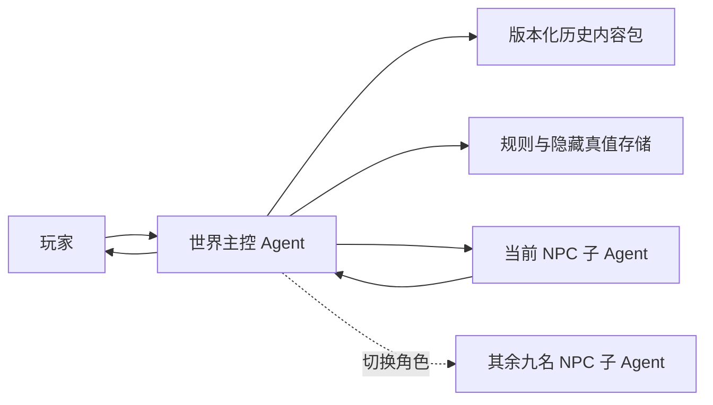

# 《特务》游戏计划

## 1. 游戏定位

一款以历史参考、混合时空和多 Agent 对话为核心的身份辨识游戏。玩家选择一个真实存在过的特务机构，扮演该机构的执行官，连续盘查十名 NPC。每名 NPC 必须完成十轮对话，之后玩家选择“放行”或“扣留”，最终以十次判断的准确率决定行动结果。

## 2. 五个机构与混合时空

五个机构的历史参考年代不同，但本作允许它们在同一套架空混合时空规则中共存。每次开局先选择机构，再由世界主控 Agent 加载该机构的目标群体、审查方式、历史参考和任务目标。时间线冲突不再阻止玩法，只需要在内容包中标记“史实参考”或“玩法设定”。

| 机构 | 建议时间范围 | 首个场景方向 | 背景重点 |
| --- | --- | --- | --- |
| 盖世太保（Gestapo） | 1933-1945 年 | 德国城市入口、铁路检查站或占领区关卡 | 纳粹统治、占领秩序、身份证件与地下抵抗网络 |
| 克格勃（KGB） | 1954-1991 年 | 苏联边境口岸、机场或封闭城市入口 | 冷战反间谍、监控体系、出入许可与意识形态审查 |
| 军统 | 1938-1946 年 | 战时重庆、交通线或陪都关卡 | 抗战时期情报战、日伪渗透、军政关系与战时交通 |
| 中统 | 1930 年代末至 1940 年代 | 国统区城市入口、车站或党政机关关卡 | 党务情报、城市组织网络、军统与中统之间的权力关系 |
| 中央情报局（CIA） | 1947-1975 年参考 | 美国联邦机关、城市入口或联络站 | 架空国内反共筛查、忠诚调查、线人网络与隐蔽联络 |

具体名称、机构沿革和时间范围仍以历史内容包为准；主控需要明确哪些是史实参考、哪些是混合时空下的玩法设定。CIA 的国内反共筛查属于本作设定，现实中的美国国内调查并不完全由 CIA 承担。

## 3. 执行官模式流程

1. 玩家选择盖世太保、克格勃、军统、中统或中央情报局。
2. 世界主控加载混合时空内容包，确定地点、当日事件、目标群体、机构方法和可用档案。
3. 主控生成本局十名 NPC 的固定角色档案和隐藏真值，并随机排列出场顺序。
4. 当前 NPC 子 Agent 进入场景，提供公开身份、证件、携带物和到达理由。
5. 玩家与当前 NPC 完成十轮对话。每轮等于一次玩家发问和一次 NPC 回答。
6. 第十轮回答结束后，文字输入锁定，“放行”和“扣留”按钮解锁。
7. 玩家作出不可撤销的决定，主控记录结果，但在本局结束前只反馈处置后果，不直接公开所有隐藏档案。
8. 主控切换到下一名 NPC，重复十轮对话和一次处置。
9. 第十名 NPC 处置完毕后，主控生成结算报告、逐人复盘和历史背景补充。

### 判断规则

- 每位 NPC 的 `isTarget` 是由主控持有的隐藏真值，NPC 子 Agent 无权修改。
- 正确放行普通来客或正确扣留目标，记为一次正确判断。
- 扣留普通来客计为误捕；放行目标计为漏网。
- 准确率 = 正确判断数 / 10 × 100%。
- 基础评级：`S`（100%）、`A`（90%）、`B`（80%）、`C`（70%）、`D`（60%）、`E`（低于 60%）。
- 误捕和漏网分别统计，作为结局文本和机构评价的依据，不用隐藏加权分替代准确率。

## 4. 潜伏者模式

潜伏者模式与执行官模式共用机构、混合时空和历史内容包，但玩家视角相反：玩家持有一份掩护身份，接受审查官 Agent 的十轮连续追问，最终由 Agent 自动判断是否放行。

1. 玩家选择机构和潜伏者身份模板，主控生成姓名、职业、来处、证件和掩护经历。
2. 审查官 Agent 依次询问身份、路线、证件、时间线、接头关系、来访目的、本地细节和压力问题。
3. 玩家自由输入回答，主控将每个回答写入事实账本，比较关键词、时间线一致性、可核验细节和回避程度。
4. 审查官 Agent 每轮调整可疑度，并在下一轮继续追问；玩家不能提前看到最终判定阈值。
5. 第十轮回答结束后，审查官 Agent 自动选择“放行”或“扣留”，玩家不能替 Agent 做决定。

潜伏者模式的主要目标是保持掩护身份的一致性，而不是回答固定选项。后续接入真实 Agent 时，审查官只能依据公开问题、角色档案和结构化事实账本判定，不能直接读取玩家的隐藏身份。

## 5. Multi-Agent 架构

### 世界主控 Agent

- 管理所选机构的世界背景、年份、地点、历史事件、制度术语和阵营关系。
- 从经过校验的历史内容包读取事实，不依赖模型临场编造历史。
- 创建十份 NPC 私密档案，并独占目标身份、证据矩阵和最终判定权。
- 维护全局回合、当前 NPC、对话轮数、玩家决定、准确率和事件日志。
- 每轮只把必要的公开世界信息与玩家原话发送给当前 NPC，禁止 NPC 之间共享私密档案。
- 检查 NPC 回答是否越出年代、地点和知识边界；发现冲突时要求 NPC 重答，而不是偷偷修改世界真值。
- 在第十轮后关闭对话并开放处置；在十名 NPC 完成后生成结算与历史说明。

### 十名 NPC 子 Agent

- 每个 NPC 是独立角色 Agent，拥有自己的公开身份、真实身份、目标、经历、说话习惯和压力反应。
- 每个 NPC 在十轮内保持连续记忆，必须记得自己说过的时间、地点、人名和理由。
- 普通来客也可以紧张、撒小谎或有秘密；目标也必须有可信的生活细节，不能用语气直接暴露身份。
- 只能依据角色档案和当时可知的历史信息作答，不能读取其他 NPC、准确率或主控判定。
- 不得自行改变 `isTarget`、证据事实或出场背景；Agent 只生成角色化表达。
- 未出场 NPC 保持休眠，主控一次只激活一名，避免十个 Agent 同时消耗资源或串话。

## 6. 历史内容包

每个机构使用独立、带版本号的内容包；主控可以把多个内容包组合到同一局混合时空中。建议至少包含：

- `organization`：机构全称、通称、沿革、组织关系和当时权限。
- `timeline`：历史参考年代、当日日期、已发生和尚未发生的事件，以及它在混合时空中的适用范围。
- `locations`：场景地图、交通方式、检查制度、证件类型和地名旧称。
- `factions`：当时存在的政府、军队、地下组织和外国势力。
- `terminology`：可使用的职务、称谓、设备、货币和生活用语。
- `forbiddenKnowledge`：该年代尚未出现的机构名称、科技、事件和人物状态。
- `settingStatus`：标记每条内容是史实参考、架空共存还是本局临时玩法设定。
- `sources`：史料或研究资料来源、摘录位置和核验日期。

历史内容可以使用真实机构、真实年代和已公开事件；十名被盘查者优先采用虚构合成人物，避免把未经证实的间谍身份安在真实普通人身上。

## 7. NPC 私密档案结构

每名 NPC 至少需要以下固定字段：

- 公开身份：姓名、年龄、职业、籍贯、证件、携带物、进城理由。
- 隐藏身份：普通来客或目标、所属阵营、真实目的和风险等级。
- 事实时间线：过去 24 小时的地点、交通、接触人和可核验事件。
- 口供方案：主动陈述、准备好的谎言、不能回答的问题和压力下的备用解释。
- 证据矩阵：至少三条真实佐证、三条可疑点，以及它们之间的依赖关系。
- 性格参数：耐心、警觉、恐惧、敌意、合作度和说话节奏。
- 知识边界：角色在当时合理知道和不知道的历史信息。
- 对话状态：已完成轮数、已说出的事实、矛盾记录和当前情绪。

线索必须支持交叉验证。普通来客和目标都至少有两条互相独立的判断依据，不能靠单一关键词、口音刻板印象或随机猜测定胜负。

## 8. 对话与状态约束

- 标准模式固定为每人十轮，共 100 轮问答；第十轮前不能处置，第十轮后不能继续追问。
- 玩家可以自由输入问题，不限制为预设选项；界面可提供“证件、路线、关系、历史环境”等非强制提示。
- 主控保存结构化事实账本，NPC 每次回答后提取其中的时间、地点、人名和主张，用于检测自相矛盾。
- NPC 可以有意撒谎，但只能使用档案里预先允许的谎言；模型意外说错不自动成为有效线索。
- 网络超时或 Agent 重试不得消耗对话轮数，只有成功返回并写入事件日志的回答才计一轮。
- 中途刷新页面后必须恢复当前 NPC、已完成轮数和全部对话，不能重新生成角色真值。

## 9. 题材与表达边界

- 五个机构均按真实历史中的政治警察或情报机关呈现，不做美化、洗白或纯粹的权力幻想包装。
- 玩法重点是信息核验、制度压力和误判代价，不提供酷刑、处决或针对受保护群体的迫害操作。
- “扣留”只代表移交复核；结算中要显示误捕对普通人的影响，不能把误捕仅视为扣分数字。
- 世界背景可以提及战争、占领、政治迫害和镇压，但应使用克制的历史叙述，并在资料页标明来源。
- 不同机构可以在同一局共存，但主控必须在资料页标注混合时空设定；CIA 追查美国共产主义分子属于本作玩法设定。
- 界面随机构变化目标群体和时代参考，同时保持统一的档案、关卡和审讯记录语言。

## 10. 开发路线

### Phase 1：规则与主控验证

- 实现机构选择、混合时空内容包装载、执行官模式和潜伏者模式。
- 完成主控状态机、隐藏真值、轮数锁定、放行/扣留和准确率结算。
- 为五个机构各准备一个入口场景和十份可测试 NPC 档案。
- 用确定性 NPC Agent 和 Judge Agent 验证规则，不在此阶段接入在线模型。

### Phase 2：NPC Agent 接入

- 接入十个相互隔离的 NPC 角色 Agent，由主控按出场顺序逐一激活。
- 实现角色记忆、事实账本、年代越界检查、回答重试和超时恢复。
- 保存完整对话、主控判定依据、模型版本和提示词版本，支持问题复现。

### Phase 3：历史质量与重玩性

- 建立五套带来源的历史内容包审核流程。
- 每局从更大的 NPC 池抽取十人，并随机组合合法的职业、路线与证据。
- 增加城市入口、车站、港口、机场和机关门岗等场景。
- 增加同一机构的不同时期历史参考，并允许受控地混入其他机构的内容包；每条混合内容必须标注来源和设定状态。

### Phase 4：完整产品化

- 增加账户存档、行动回放、历史资料页、无障碍与移动端布局。
- 记录回答延迟、模型成本、矛盾率、历史错误率和玩家判断分布。
- 依据测试数据调整目标比例与线索强度，不让模型随机性直接决定胜负。

## 11. 验收指标

- 玩家选择任一机构后，看到的目标群体、审查方式和机构术语与该机构一致；混合出现的年代内容会标明是史实参考还是玩法设定。
- 每局固定十名 NPC，每名恰好十轮成功对话后才开放放行或扣留。
- 十个 NPC 的隐藏身份在开局时固定，刷新、重试或模型更换后不发生变化。
- 同一 NPC 的十轮回答不存在非角色故意造成的事实矛盾；可控谎言能在私密档案中追溯。
- 主控在决定前不泄露 `isTarget`，NPC 子 Agent不能读取判定和其他角色档案。
- 结算准确展示正确判断、误捕、漏网、准确率和逐人依据。
- 潜伏者模式中，审查官 Agent 完成十轮后自动给出放行或扣留，玩家不能代替审查官做决定。
- 潜伏者模式刷新后能恢复当前问题、回答轮数、可疑度和审查记录。
- 一局 100 轮对话应支持断点续玩；目标时长暂定 30 至 60 分钟，以试玩数据调整。
- 历史内容包中的关键事实有来源记录；允许有意的混合时空，但禁止把未标记的时代错置伪装成史实。
- 移动端 390px 宽度下，对话、轮数、档案和处置控件不遮挡或溢出。
