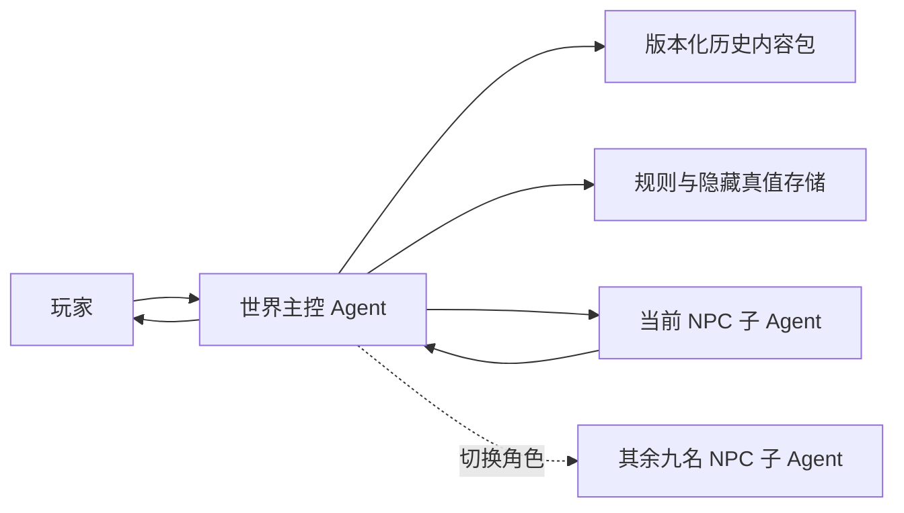

# 《特务》游戏计划

## 1. 游戏定位

一款以历史参考、混合时空和多 Agent 对话为核心的身份辨识游戏。玩家选择一个真实存在过的特务机构，扮演该机构的执行官，连续盘查十名 NPC。每名 NPC 可以盘问两至十轮；十人全部盘问结束后，玩家从名单中选择任意数量的对象统一扣留，最终以十次判断的准确率决定行动结果。

## 2. 五个机构与混合时空

五个机构的历史参考年代不同，但本作允许它们在同一套架空混合时空规则中共存。每次开局先选择机构，再由世界主控 Agent 加载该机构的目标群体、审查方式、历史参考和任务目标。时间线冲突不再阻止玩法，只需要在内容包中标记“史实参考”或“玩法设定”。

| 机构 | 建议时间范围 | 首个场景方向 | 背景重点 |
| --- | --- | --- | --- |
| 盖世太保（Gestapo） | 1933-1945 年 | 德国城市入口、铁路检查站或占领区关卡 | 纳粹统治、占领秩序、身份证件与地下抵抗网络 |
| 克格勃（KGB） | 1954-1991 年 | 苏联边境口岸、机场或封闭城市入口 | 冷战反间谍、监控体系、出入许可与意识形态审查 |
| 军统 | 1938-1946 年 | 战时重庆、交通线或陪都关卡 | 抗战时期情报战、日伪渗透、军政关系与战时交通 |
| 中统 | 1930 年代末至 1940 年代 | 国统区城市入口、车站或党政机关关卡 | 党务情报、城市组织网络、军统与中统之间的权力关系 |
| 中央情报局（CIA） | 1947-1975 年参考 | 美国联邦机关、城市入口或联络站 | 架空国内反共筛查、忠诚调查、线人网络与隐蔽联络 |

具体名称、机构沿革和时间范围仍以历史内容包为准；主控需要明确哪些是史实参考、哪些是混合时空下的玩法设定。CIA 的国内反共筛查属于本作设定，现实中的美国国内调查并不完全由 CIA 承担。

## 3. 执行官模式流程

1. 玩家选择盖世太保、克格勃、军统、中统或中央情报局。
2. 世界主控加载混合时空内容包，确定地点、当日事件、目标群体、机构方法和可用档案。
3. 主控生成本局十名 NPC 的固定角色档案和隐藏真值，并随机排列出场顺序。
4. 当前 NPC 子 Agent 进入场景，提供公开身份、证件、携带物和到达理由。
5. 玩家分别与十名 NPC 进行最多十轮对话；在本阶段不要求逐人作出放行或扣留决定。
6. 每轮回答都写入案件事实账本，跨 NPC 的陈述、关系和时间线汇总到同一张案情板。
7. 十名 NPC 全部盘问结束后，玩家从十人中选择若干名认为与目标有关的对象，统一提交扣留名单；未选中的对象视为放行。
8. 主控公开本局处置结果，分别统计目标命中、误捕和漏网。
9. 主控生成结算报告、逐人复盘、关系网络和历史背景补充。

### 判断规则

- 每位 NPC 的 `isTarget` 是由主控持有的隐藏真值，NPC 子 Agent 无权修改。
- 玩家提交名单后，名单中的目标计为命中，名单中的普通来客计为误捕；未入选的目标计为漏网，未入选的普通来客计为正确放行。
- 准确率 = 十名 NPC 中判断正确的人数 / 10 × 100%。名单可以为空，也可以包含多人，不限制固定扣留人数。
- 基础评级：`S`（100%）、`A`（90%）、`B`（80%）、`C`（70%）、`D`（60%）、`E`（低于 60%）。
- 误捕和漏网分别统计，作为结局文本和机构评价的依据，不用隐藏加权分替代准确率。

## 4. 潜伏者模式

潜伏者模式与执行官模式共用机构、混合时空和历史内容包，但玩家视角相反：玩家持有一份掩护身份，接受审查官 Agent 的十轮连续追问，最终由 Agent 自动判断是否放行。

1. 玩家选择机构和潜伏者身份模板，主控生成一套完整、固定且可随时查阅的掩护档案。
2. 审查官 Agent 依次询问身份、路线、证件、时间线、接头关系、来访目的、本地细节和压力问题。
3. 玩家自由输入回答，主控将每个回答写入事实账本，核对掩护档案、前文陈述、问题相关性、可核验细节和回避程度。
4. 审查官 Agent 每轮返回结构化审查评价，主控把 Agent 评价与可确定的档案核对结果合成为可疑度，并在下一轮继续追问；玩家不能提前看到最终判定阈值。
5. 第十轮回答结束后，审查官 Agent 自动选择“放行”或“扣留”，玩家不能替 Agent 做决定。

潜伏者模式的主要目标是保持掩护身份的一致性，而不是回答固定选项。后续接入真实 Agent 时，审查官只能依据公开问题、角色档案和结构化事实账本判定，不能直接读取玩家的隐藏身份。

### 4.1 完整掩护档案

玩家不应在只有姓名、职业、来处和携带物的情况下临场编造整段人生。主控在进入审查前必须提供并固定以下内容，审查过程中仍可随时查看：

- 身份与证件：姓名、职业、所属单位、证件类型、编号、签发处和可核验记录。
- 路线与时间：出发地点、出发时间、沿途路线、换乘点、到达时间及哪些路段会留下记录。
- 携带物：物品清单、用途、编号或封签，以及与职业相符的来源。
- 公开关系：一名有姓名和职务的联系人、双方关系、约定地点与正常联络方式。
- 行动目的：本次进城要完成的具体工作，以及完成后会留下的回执、登记或交接结果。
- 本地知识：与场景有关、玩家可以合理说出的地名、制度、入口和生活细节。
- 口径边界：档案明确写出的内容必须保持一致；档案没有写出的细枝末节可以补充，但不能自动视为真，也不能仅因使用同义词而受罚。

本人姓名、联系人姓名和联系人职务必须在界面上分栏常驻显示，避免玩家仅因记混角色而失败。玩家仍可在回答中声称存在档案外人物，但该人物只能作为“未经档案支持的新关系”进入记录；在后续说法和可核验依据闭合前，审查官不得把随口编造的人名当成有效掩护。把本人姓名、公开联系人或所属单位混用时，应明确记为档案不符，而不是含糊归类为语气可疑。

档案在开局时写入存档，刷新、Agent 重试和断点恢复不得重新生成。审查官 Agent 能看到与玩家相同的掩护档案和此前对话，但不能看到“玩家必定是潜伏者”之类可直接决定结论的字段。

### 4.2 混合审查判定

放行和扣留不再由隐藏关键词命中数直接决定。每轮先由审查官 Agent 根据本轮问题、完整掩护档案和此前对话返回五项受限评价：

- `relevance`：是否正面回答当前问题。
- `specificity`：是否给出时间、编号、地点、人物或记录等可核验细节。
- `dossierMatch`：是否符合固定掩护档案；使用合理同义表达不得扣分。
- `consistency`：是否与此前回答保持一致，或对修正给出可信原因。
- `evasiveness`：是否回避、转移问题或用空泛表态替代事实。

主控只接受限定范围内的数值和档案中存在的事实 ID，再与少量确定性规则合成当轮可疑度变化。确定性规则只处理回答过短、明确拒答、精确档案锚点命中等可以机械确认的情况；未命中某个词不能单独增加可疑度。Agent 评价异常或网络降级时使用中性、可解释的本地核对，不允许一次模型输出直接决定整局胜负。

结算必须逐轮展示评价摘要、可疑度变化和主要依据。玩家应能理解自己是因为事实冲突、缺少细节还是持续回避而被扣留，而不是因为没有猜中系统关键词。

### 4.3 连续审查与难度约束

真实 Agent 试玩暴露出固定题库与模型反应脱节的问题：审查官在台词里要求补充换乘、交班时间或备用渠道，主控却直接切换到下一道固定题，导致玩家无法回答刚刚收到的追问。潜伏者模式改用“八个必查主题、最多一次即时追问、第十轮总结”的流程：

1. 八个必查主题为身份、路线、证件与物品、时间线、公开关系、来访目的、本地观察和压力反应。
2. 审查官 Agent 每轮同时返回本轮反应、当前主题的追问候选和下一个必查主题的问题候选；主控持有主题顺序和最终决定权。
3. 当回答没有正面回应、缺少关键细节或存在档案冲突时，主控可以立即采用一次追问候选；追问占用一轮，但整局最多一次，避免审查陷在同一主题。
4. 八个主题提前完成时，第九轮复核本局评价最弱的主题；第十轮固定为最终补充，不允许 Agent 提前宣布放行或扣留。
5. Agent 的可见反应不得自行附加一条不会被主控采用的问题。实际下一题只显示在统一提问区。

档案与口供必须在提示词和数据结构中分离。掩护档案只能用于核对，不能算作玩家“此前说过”的内容；只有先前 `speaker=player` 的回答可以被称为重复口供。本轮回答也不能在历史数组和当前回答字段中重复发送。

每个固定问题都必须有公平的信息来源。路线档案明确最后一次换乘和到达时间，时间线明确交班时刻，本地观察则使用“自由口径”而不是要求玩家凭空猜一个系统答案。自由口径遵循以下规则：

- 每局提供两项可自行确定的细节，例如无记录路段和现场观察。
- 玩家第一次在对应主题给出具体说法后，Agent 提取一条简短陈述，主控将其锁定并写入存档。
- 后续回答只检查该说法是否前后一致；首次合理补充不算档案外事实，也不因未使用预设措辞扣分。
- 本人姓名、固定联系人、证件编号等核心档案字段不属于自由口径，仍不得随意改写。

警戒变化必须满足硬门槛：`relevance < 2` 或 `specificity = 0` 时，本轮不能降低警戒；`dossierMatch = 0` 或 `consistency = 0` 时，本轮至少提高警戒。单轮最多降低 3 点，避免六轮后警戒已经归零而后续审查失去意义。Agent 输出的英文内部字段名必须在进入玩家可见记录前转换为中文。

## 5. Multi-Agent 架构



### 世界主控 Agent

- 管理所选机构的世界背景、年份、地点、历史事件、制度术语和阵营关系。
- 从经过校验的历史内容包读取事实，不依赖模型临场编造历史。
- 创建十份 NPC 私密档案，并独占目标身份、证据矩阵和最终判定权。
- 维护全局回合、当前 NPC、对话轮数、玩家决定、准确率和事件日志。
- 每轮只把必要的公开世界信息与玩家原话发送给当前 NPC，禁止 NPC 之间共享私密档案。
- 检查 NPC 回答是否越出年代、地点和知识边界；发现冲突时要求 NPC 重答，而不是偷偷修改世界真值。
- 在玩家主动结束或达到第十轮时关闭当前对话；十名 NPC 全部完成后开放统一扣留名单，并在提交后生成结算与历史说明。

### 十名 NPC 子 Agent

- 每个 NPC 是独立角色 Agent，拥有自己的公开身份、真实身份、目标、经历、说话习惯和压力反应。
- 每个 NPC 在十轮内保持连续记忆，必须记得自己说过的时间、地点、人名和理由。
- 普通来客也可以紧张、撒小谎或有秘密；目标也必须有可信的生活细节，不能用语气直接暴露身份。
- 只能依据角色档案和当时可知的历史信息作答，不能读取其他 NPC、准确率或主控判定。
- 不得自行改变 `isTarget`、证据事实或出场背景；Agent 只生成角色化表达。
- 未出场 NPC 保持休眠，主控一次只激活一名，避免十个 Agent 同时消耗资源或串话。

## 6. 历史内容包

每个机构使用独立、带版本号的内容包；主控可以把多个内容包组合到同一局混合时空中。建议至少包含：

- `organization`：机构全称、通称、沿革、组织关系和当时权限。
- `timeline`：历史参考年代、当日日期、已发生和尚未发生的事件，以及它在混合时空中的适用范围。
- `locations`：场景地图、交通方式、检查制度、证件类型和地名旧称。
- `factions`：当时存在的政府、军队、地下组织和外国势力。
- `terminology`：可使用的职务、称谓、设备、货币和生活用语。
- `forbiddenKnowledge`：该年代尚未出现的机构名称、科技、事件和人物状态。
- `settingStatus`：标记每条内容是史实参考、架空共存还是本局临时玩法设定。
- `sources`：史料或研究资料来源、摘录位置和核验日期。

历史内容可以使用真实机构、真实年代和已公开事件；十名被盘查者优先采用虚构合成人物，避免把未经证实的间谍身份安在真实普通人身上。

## 7. NPC 私密档案结构

每名 NPC 至少需要以下固定字段：

- 公开身份：姓名、年龄、职业、籍贯、证件、携带物、进城理由。
- 隐藏身份：普通来客或目标、所属阵营、真实目的和风险等级。
- 事实时间线：过去 24 小时的地点、交通、接触人和可核验事件。
- 口供方案：主动陈述、准备好的谎言、不能回答的问题和压力下的备用解释。
- 证据矩阵：至少三条真实佐证、三条可疑点，以及它们之间的依赖关系。
- 性格参数：耐心、警觉、恐惧、敌意、合作度和说话节奏。
- 知识边界：角色在当时合理知道和不知道的历史信息。
- 对话状态：已完成轮数、已说出的事实、矛盾记录和当前情绪。

### 7.1 案件事实引擎

NPC 的回答不能由 LLM 自由创造案件事实。主控先为每名 NPC 建立结构化事实，再由 LLM 把事实表达成符合人格的中文回答。每个关键事实都有稳定的 `factId`，例如 `old_checkpoint_shift_change`、`route_departure_time` 和 `radio_technician_link`。

```js
{
  factId: "old_checkpoint_shift_change",
  category: "时间线",
  truth: "22:00 换岗",
  publicKnowledge: true,
  npcKnowledge: "direct",
  coverClaim: "22:20 到达",
  evidence: ["铁路交接簿", "候选人 04 号的独立陈述"],
  allowedResponses: ["明确回答", "模糊回答", "把问题转向货运单"]
}
```

普通来客也必须拥有私人秘密、无关违规或记忆缺口；潜伏者必须拥有真实职业细节和可验证的生活经历。玩家要判断的是事实、关系和时间线能否闭合，而不是谁更紧张或更愿意配合。

### 7.2 社会处境与政治立场

同一职业在不同机构和社会背景下不使用同一套人格。人格由三层叠加：职业视角、机构制度压力和个人利益。政治问题不采用标准答案，人物可以是坚定信徒、机会主义者、沉默求生者、公开服从的私人反感者或只关心职业的人。

例如“你如何看待元首”“你怎么看待西方广播”“你是否参加过共产主义组织”等问题，只有与人物的工作经历、家庭压力、组织关系和实际路线交叉后才有判断价值。

线索必须支持交叉验证。普通来客和目标都至少有两条互相独立的判断依据，不能靠单一关键词、口音刻板印象或随机猜测定胜负。

## 8. 对话与状态约束

- 标准模式每人最多十轮、至少两轮；玩家可以提前结束当前人的盘问，也可以继续追问至十轮。单人结束时不作处置，标准一局最多 100 轮问答。
- 玩家可以自由输入问题，不限制为预设选项；界面可提供“证件、路线、关系、历史环境”等非强制提示。
- 主控保存结构化事实账本。NPC 每次回答返回角色化 `speech` 以及受限的 `claims`，主控只接受档案中存在的 `factId`，再把主张标为“待核对、相互支持或出现差异”。
- NPC 可以有意撒谎，但只能使用档案里预先允许的谎言；模型意外说错不自动成为有效线索。
- 网络超时或 Agent 重试不得消耗对话轮数，只有成功返回并写入事件日志的回答才计一轮。
- 中途刷新页面后必须恢复当前 NPC、已完成轮数和全部对话，不能重新生成角色真值。

### 8.1 跨 NPC 关系网络

每局十名 NPC 组成一个小型关系图，至少包含三条关系链：正常工作关系、无关但容易误判的私人关系，以及与潜伏任务有关的秘密关系。后来的 NPC 可以证实、修正或否认前一名 NPC 的主张，但不能读取其他角色的私密档案。

证据板只显示原始陈述、来源、地点和当前状态，不显示“好人/可疑”“路线正确”“关系公开”等替玩家做结论的标签。本地知识用于帮助玩家设计问题，不能直接替玩家判断身份。

### 8.2 可玩性改进优先级

当前版本已经具备完整的一局流程，但要让玩家愿意重开，需要优先改善内容变化和对话反馈，而不是增加资源管理或额外审问阶段：

1. 每局随机排列十名 NPC，并从合法档案中随机抽取目标组合；随机结果写入存档，刷新和断点恢复不得改变隐藏真值。
2. 扩充 NPC 档案池和职业人格，为同一主题准备多种追问回应，减少固定句式和“问过了”的机械感。
3. 让机构特色问题真正影响角色的立场、压力反应和可核验细节；政治问题不设标准答案，判断依据必须回到关系、路线和记录。
4. 增加跨 NPC 的可验证关系组合，让普通人的私人秘密、无关违规和目标的掩护经历都能制造合理误导。
5. 结算时展示命中、误捕和漏网分别对应的关键依据，帮助玩家理解判断失误，但不在盘问阶段直接公布答案。

本阶段已完成第 1 项，并完成第 2、3、5 项的首轮实现：角色池从十人扩展到二十人，新局随机抽取十人并随机生成四名目标；重复主题会补充不同的可核验角度；机构立场问题进入事实账本；结算逐人展示复盘重点。下一轮内容工作集中在继续扩充 NPC 档案池和关系链组合。目标是让同一机构连续游玩时，玩家面对的是不同的出场顺序、目标组合和证据链，而不是背诵固定名单。

## 9. 题材与表达边界

- 五个机构均按真实历史中的政治警察或情报机关呈现，不做美化、洗白或纯粹的权力幻想包装。
- 玩法重点是信息核验、制度压力和误判代价，不提供酷刑、处决或针对受保护群体的迫害操作。
- “扣留”只代表移交复核；结算中要显示误捕对普通人的影响，不能把误捕仅视为扣分数字。
- 世界背景可以提及战争、占领、政治迫害和镇压，但应使用克制的历史叙述，并在资料页标明来源。
- 不同机构可以在同一局共存，但主控必须在资料页标注混合时空设定；CIA 追查美国共产主义分子属于本作玩法设定。
- 界面随机构变化目标群体和时代参考，同时保持统一的档案、关卡和盘问记录语言。

## 10. 开发路线

### Phase 1：规则与主控验证

- 实现机构选择、混合时空内容包装载、执行官模式和潜伏者模式。
- 完成主控状态机、隐藏真值、轮数锁定、十人统一扣留名单和准确率结算。
- 为五个机构各准备一个入口场景和十份可测试 NPC 档案。
- 用确定性 NPC Agent 和 Judge Agent 验证规则，不在此阶段接入在线模型。

### Phase 2：NPC Agent 接入

- 接入十个相互隔离的 NPC 角色 Agent，由主控按出场顺序逐一激活。
- 实现角色记忆、事实账本、年代越界检查、回答重试和超时恢复。
- 保存完整对话、主控判定依据、模型版本和提示词版本，支持问题复现。

### Phase 3：历史质量与重玩性

- 建立五套带来源的历史内容包审核流程。
- 每局从更大的 NPC 池抽取十人，并随机组合合法的职业、路线与证据。
- 增加城市入口、车站、港口、机场和机关门岗等场景。
- 增加同一机构的不同时期历史参考，并允许受控地混入其他机构的内容包；每条混合内容必须标注来源和设定状态。

### Phase 4：完整产品化

- 增加账户存档、行动回放、历史资料页、无障碍与移动端布局。
- 记录回答延迟、模型成本、矛盾率、历史错误率和玩家判断分布。
- 依据测试数据调整目标比例与线索强度，不让模型随机性直接决定胜负。

## 11. 验收指标

- 玩家选择任一机构后，看到的目标群体、审查方式和机构术语与该机构一致；混合出现的年代内容会标明是史实参考还是玩法设定。
- 每局固定十名 NPC，每名至少两轮、最多十轮；十人全部完成后才开放统一扣留名单。
- 每局十人的出场顺序和目标组合可变化；刷新或恢复存档后必须保持本局已经生成的名单和隐藏真值。
- 十个 NPC 的隐藏身份在开局时固定，刷新、重试或模型更换后不发生变化。
- 同一 NPC 的十轮回答不存在非角色故意造成的事实矛盾；可控谎言能在私密档案中追溯。
- 主控在决定前不泄露 `isTarget`，NPC 子 Agent不能读取判定和其他角色档案。
- 结算准确展示正确判断、误捕、漏网、准确率和逐人依据。
- 潜伏者模式中，审查官 Agent 完成十轮后自动给出放行或扣留，玩家不能代替审查官做决定。
- 潜伏者进入审查前能够查看完整掩护档案；审查过程中可以随时核对证件、路线、时间、物品、联系人、目的和本地知识。
- 潜伏者判定同时使用受限的 Agent 结构化评价和确定性档案核对；同义表达不因缺少预设关键词而受罚，前后矛盾能够进入评价依据。
- 潜伏者的八个必查主题都有玩家可见的档案依据；换乘、交班时间等问题不得要求档案中不存在的标准答案。
- 审查官最多进行一次即时追问，追问会成为下一轮真正显示的问题；第十轮之前不得宣布放行或扣留。
- 掩护档案、先前口供和当前回答在 Agent 输入中明确分离，档案内容不得被错误描述为玩家重复陈述。
- 至少两项自由口径能在首次回答后锁定并随存档恢复，后续只按一致性核验。
- 相关性不足或没有具体细节的回答不能降低警戒，单轮降低值不超过 3 点。
- 潜伏者结算逐轮展示评价摘要和警戒变化，服务端拒绝越界分值和档案外事实 ID。
- 潜伏者模式刷新后能恢复当前问题、回答轮数、可疑度和审查记录。
- 一局 100 轮对话应支持断点续玩；目标时长暂定 30 至 60 分钟，以试玩数据调整。
- 历史内容包中的关键事实有来源记录；允许有意的混合时空，但禁止把未标记的时代错置伪装成史实。
- 移动端 390px 宽度下，对话、轮数、档案和处置控件不遮挡或溢出。
